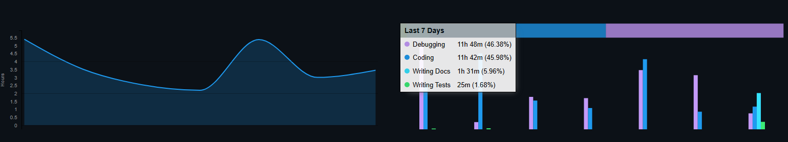

## Sobre o projeto:
**Codei** é uma mini plataforma de exercícios de códigos que foi desenvolvida durante uma semana e meia para o **Bootcamp Unimar 2026**.

A ideia do projeto é implementar a principal funcionalidade desse tipo de plataforma que é a resolução de exercícios, além da possibilidade de administradores adicionarem e editarem exercícios.

## Demonstração
[Demonstração no Youtube](https://www.youtube.com/watch?v=Uf1xk5vxqkM)

## Como rodar o projeto:
Primeiro **instale o projeto** usando ``pip``
```
pip install .
```
Depois **execute o main** do client:
```
python src/leety/client/main.py
```

## Aprendizados:
###### Nessa seção vou registrar o que aprendi com esse projeto
Gostaria de iniciar essa seção mencionando que eu não muito bom com design gráfico e não gosto muito de fazer interfaces gráficas. Por isso, **o principal aprendizado que eu tive com esse projeto foi sobre como usar o `tkinter`**.
#### tkinter:
Quando eu iniciei esse projeto eu não tinha ideia de como usar o `tkinter`. Confesso que várias vezes tive que pedir para chatbots me explicarem como fazer coisas específicas, como centralizar elementos dentro de `grid`s ou `pack`s.
O importante é que através desse projeto eu consegui aprender bastante sobre o `tkinter`, no fim das contas a interface ficou bem agradável (para o meu gosto), acho que o histórico com java swing ajudou um pouco.
#### Outras coisas:
Para não falar que eu só aprendi a mexer com o `tkinter`, eu também aprendi como funcionam subprocessos em python, como implementar um banco de dados baseado em `.csv` com typesafety decente.

## Sobre a implementação:
###### Nessa seção vou deixar registrado meus comentários sobre a implementação do projeto (incluindo opiniões pessoais)
Eu comecei a desenvolver esse projeto no dia 24 de agosto, mas eu já tinha diversas ideias de como implementar. A única coisa que eu não tinha ideia de como seria implementada era a execução de código dos usuários (já que é uma questão de segurança).
Outra coisa que eu acho relevante é que eu evitei ao máximo usar bibliotecas externas como `pydantic` ou qualquer outro tipo de biblioteca que facilitasse a implementação de algo (foi por isso que eu implementei o banco de dados manualmente).
### Arquitetura do projeto:
O projeto foi inicialmente desenvolvido pensando apenas no [servidor](/src/leety/server) e depois eu acabei desenvolvendo uma interface usando o tkinter conforme proposto nas aulas.
#### Estrutura de pastas
###### OBS: leety era o nome do projeto até hoje (04/09/2026), eu já tinha pensado em codei, mas acabei mantendo as pastas como leety
###### O nome leety vem de leetcode só que sem "code" e com "y" no final porque o meu primeiro projeto tinha "y" no final também (windy)
```
src/
    leety/
        client/ 
            -> Tudo que é especifico da interface gráfica (coisas do tkinter, etc)
        common/ 
            -> Tudo que é compartilhado entre o servidor e o client
            -> por exemplo: o sistema de banco de dados, FieldModels, etc
        server/
            -> Tudo que é específico do servidor
            -> por exemplo: sandbox_controller, controllers para acessar o banco, etc
```

#### Implementação dos exercícios:
Os exercícios foram implementados seguindo o conceito de que não faz sentido você ter que fazer `n0 = int(input())` (eu acho bem chato ter que fazer isso). Dessa forma, eu acabei implementando um sistema que é baseado em classes e funções semelhantes à um `public static void main()` do Java.
O sistema de exercício consiste em duas classes principais:
- **[Generator](src/leety/common/exercise/templates/generator.py)**: que **implementa duas funções: `generate_inputs` e `solver`**. Como os nomes já inferem, a primeira deve gerar valores de entrada que serão passados ao `solver` para gerar resultados válidos*. A partir disso, **o servidor** (mais especificamente o [ExerciseController](src/leety/server/exercise/exercise_controller.py)) **gera pares de [TestCase](src/leety/server/exercise/base_generator.py)** que são armazenados dentro de um arquivo `.json` (`samples.json` dentro da pasta do exercício em `tables/uploads/exercises`) e **posteriormente usados para validar a solução do usuário**;
- **[Solution](src/leety/common/exercise/templates/solution.py)**: que apresenta **a função `solve` implementada pelo usuário** (teoricamente**), **que deve retornar o valor correto** para o exercício **com base na entrada recebida**. Esse arquivo é um template só pra ter uma noção do formato da classe, o arquivo que é enviado para o usuário quando ele seleciona para "Criar Solução" é gerado pelo [ExerciseController](src/leety/server/exercise/exercise_controller.py) e pelo [TemplateUtils](src/leety/server/exercise/template_utils.py).
###### * validade é um conceito relativo porque é 100% dependente do exercício
###### ** "teoricamente" porque se o usuário não quiser, ele pode fazer o que bem entender no arquivo de solução (a menos que alguma exceção seja elevada e cause um resultado de RuntimeError)
Essas duas classes + a implementação do banco de dados (e os controllers) é o que forma o Codei de fato. Porque no fim das contas a interface não é obrigatória para o sistema funcionar.
É claro que existem outras etapas, como os `runners` que executam os códigos implementados pelos usuários e admins, mas não tem muito o que falar sobre eles. São basicamente arquivos que importam o código do usuário e chamam as funções. Esses runners são copiados para dentro da pasta do `job` dentro da "sandbox" e um outro arquivo ([CodeRunner](src/leety/common/utils/code_runner.py)) cria um subprocesso para executar o ``runner``. Entretanto, o básico para funcionar é essas duas classes.

#### Implementação do banco de dados:
Eu, particularmente, gostei muito da minha implementação do banco de dados. A ideia era fazer uma versão melhorada do meu "primeiro banco de dados" (implementado no [Bootcamp de 2024](https://github.com/yDewolf/Windy)), como aquele banco era baseado em arquivos .csv, eu mantive a mesma ideia só que explorei mais os conceitos que aprendi sobre typesafety e tipagem em python.
As principais classes do banco são:
- **[Field](src/leety/common/internals/database/protocols/model/field_model.py):** que **descreve um campo de um modelo** (`FieldModel`). Nele tem alguns overloads do `__get__` e `__set__` para gerenciar corretamente o acesso das informações e manter os auto complete do VS Code, etc.
- **[FieldModel](src/leety/common/internals/database/protocols/model/field_model.py):** **armazena os dados dos `Fields`** que são atribuídos dentro dele (na variável `_data` como `{field_name: value, ...}`). Essa é meio que uma classe abstrata que deve ser herdada para criar os `Fields` específicos do seu modelo. (Exemplos: [UserModel](src/leety/common/database/models/user_model.py) e [ExerciseModel](src/leety/common/database/models/exercise_model.py))
- **[IndexableFieldModel](src/leety/common/internals/database/protocols/model/default_models.py):** é uma classe que herda `FieldModel` e **implementa coisas relacionadas à indexação**, basicamente tem alguns dicionários que são utilizados para não ter que fazer um `for field in self.header_keys()` toda vez que fosse procurar um field ou algo do tipo.
- **[Table](src/leety/common/internals/database/protocols/csv_table.py):** é outra classe "abstrata" que deve ser instanciada usando anotação (`Table[ModelType]`). As `Table`s **armazenam vários modelos do tipo `ModelType`** dentro de uma lista, além de fazer outras coisas úteis como implementar funções de `get` (chamado de `match_linear` dentro do código), `to_csv_str`
- **[IndexableTable](src/leety/common/internals/database/protocols/csv_table.py):** é que semelhante ao `IndexableFieldModel`, uma classe que herda `Table` para implementar **funções baseada em indexação de valores**. Essa classe oferece funções como: `get_field_by_id`, `match_searchable_fields`, entre outras.
- **[Database](src/leety/common/internals/database/csvbase.py):** é uma classe semelhante ao `FieldModel` no que tange a funcionalidades, basicamente ela **armazena tabelas** que são descritas em subclasses (que herdam `_Database`).
###### `SearchableField` é uma classe que não implementa nada e só é usada para checar se um `Field` deve ser indexado como "pesquisável"

#### Implementação do "Servidor":
Inicialmente eu gostaria de implementar um sistema 100% backend, sem interface alguma, mas que expusesse uma API Restful HTTP para que _clients_ pudessem acessar e modificar as coisas. 
###### É por isso que tem um [RouterProtocol](src/leety/server/internal/router_protocol.py) na pasta server. A ideia era implementar um "Router" que receberia as requisições HTTP e mapearia para as funções.
###### No fim das contas o [Server](src/leety/server/server.py) virou o Router, só que ele é acessado diretamente pelo [Client](src/leety//client/main.py) como um "servidor interno".
Por conta do prazo, eu acabei desistindo dessa ideia da API e acabei implementando a interface com o tkinter e tudo mais.
O que é relevante sobre o servidor é a implementação do "sandbox" e os controllers.
#### "[Sandbox](src/leety/server/sandbox/sandbox_controller.py)":
A minha implementação de um ambiente "Sandbox" é na verdade só uma pasta separada para os códigos rodarem dentro. Não existe nenhuma medida de segurança para evitar que os códigos acessem informações sigilosas ou qualquer façam qualquer coisa com o seu sistema.
A ideia inicial era tentar implementar isso usando containers do Docker, mas não era muito escalável e ia levar tempo porque eu não sei usar Docker direito, então acabou que eu desisti das medidas de segurança e foquei mais em implementar as funcionalidades de rodar códigos etc (veja [CodeRunner](src/leety/common/utils/code_runner.py)).


#### Controllers:
Os controllers aqui são só classes usadas para isolar o funcionamento de algumas tabelas específicas. Como não deu tempo de implementar um sistema decente de relacionamento entre as tabelas, algumas partes do código é só implementando "relacionamentos" (atualizações dinâmicas) manualmente (atualizar em toda ação que modifica algo).
Os principais controllers são:
- **[ExerciseController](src/leety/server/exercise/exercise_controller.py)**: que lida com o CRUD dos exercícios, além da geração de samples e outras coisas relacionadas à exercícios;
- **[SolutionController](src/leety/server/exercise/solution_controller.py)**: lida com o "CRUD" das soluções, que é mais um CR do que CRUD. Nela tem funções para enviar as tentativas e validá-las.
- **[UserController](src/leety/server/user/user_controller.py)**: lida com o CRUD de usuários e outras funções utilitárias como `is_admin`, `is_username_registered` e `log_as_user` (que retorna os dados do usuário caso o usuário e senha estejam corretos)

### Comentários finais:
Gostaria de adicionar no fim desse readme minhas opiniões finais sobre o projeto e o evento.
Esse ano, infelizmente, não pudi participar de todas as aulas devido a motivos pessoais o que tornou o processo de desenvolvimento bem caótico. Uma das consequências disso foi eu descobrir sobre o uso do `tkinter` na segunda-feira (31/08), faltando praticamente 3 dias para a data de entrega, então foi bem difícil organizar meu tempo para finalizar o projeto. 
Felizmente, foi possível finalizar praticamente tudo que eu de fato gostaria de implementar.
No fim eu fiquei bem satisfeito com o projeto em praticamente todos os aspectos, o que eu melhoraria seria a interface e a organização dos arquivos do client e provavelmente a segurança do meu sistema de "sandbox".

### Estatísticas do wakatime:


